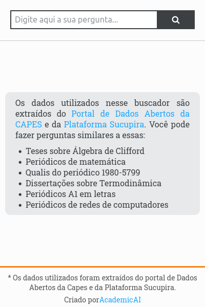

<h1 align="center">
 🔎 Buscador-Acadêmico 🎓
</h1>
<div align="center">
  
</div>

**🎓 AcademicAI** é um projeto em andamento que visa aplicar técnicas de inteligência artificial para recuperar e organizar dados da produção intelectual e científica nacional. Neste repositório, disponibilizamos o código fonte referente ao nosso _buscador_, o qual foi criado utilizando o [Create React App](https://github.com/facebook/create-react-app).

## :hammer_and_wrench:Como executar o projeto

É necessário possuir o [Git](https://git-scm.com/) e [NodeJs](https://nodejs.org/en/) instalados para prosseguir com as etapas a seguir. Utilizamos o [Yarn](https://yarnpkg.com/) como o nosso gerenciador de pacotes do node.

### Executando localmente

Para desenvolver a aplicação localmente, precisamos executar o servidor de desenvolvimento:

```bash
# Faça clone deste repositório
git clone https://github.com/academicai/buscador-academico.git
# Entre na pasta do repositório
cd buscador-academico
# Instale as dependências
yarn install
# Execute a aplicação localmente
yarn start
```

## :information_source: ​Informações

-   As informações sobre Qualis-Periódicos foram obtidas da [Plataforma Sucupira](https://sucupira.capes.gov.br/sucupira/) via _webscraping_.
-   Demais dados foram extraídos do [Portal de Dados Abertos da CAPES](https://dadosabertos.capes.gov.br/).
-   Esse buscador tenta fazer uma correspondência entre a pergunta e os dados para retornar os resultados mais similares.
-   O conteúdo dos dados não é gerado artificialmente e nem pelos autores.
-   Algumas informações do resultado podem ser truncadas caso ultrapassem a quantidade máxima caracteres.
